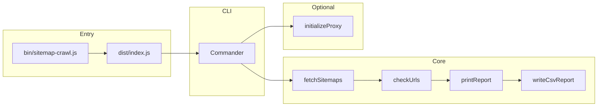

# sitemap-crawl — Architecture

## Overview

sitemap-crawl is a TypeScript ESM CLI that fetches and parses sitemap XML (and sitemap index files), checks each URL with configurable concurrency, and outputs results to the terminal and optionally to a CSV file. Optional Zyte Smart Proxy Manager support routes requests through a proxy when `ZYTE_API_KEY` is set.

## Data flow

1. User runs `sitemap-crawl <url>` (or `npx sitemap-crawl <url>`)
2. `bin/sitemap-crawl.js` loads `dist/index.js`
3. Commander parses args; if `ZYTE_API_KEY` is set, `initializeProxy` configures undici
4. `fetchSitemaps(url)` fetches and parses sitemap XML (or index), returns `Sitemap[]`
5. For each sitemap: `checkUrls()` runs with p-limit concurrency
6. `printReport()` outputs color-coded results to terminal
7. If `--csv` is set, `writeCsvReport()` writes to `reports/<filename>`

## Modules table

| File | Responsibility |
|------|----------------|
| `src/index.ts` | CLI entry — Commander setup, option parsing, orchestration |
| `src/types.ts` | Shared TypeScript types (SitemapUrl, Sitemap, UrlCheckResult, SitemapReport, etc.) |
| `src/sitemap.ts` | Fetch and parse sitemap XML / sitemap index; handle gzip |
| `src/checker.ts` | HTTP status checking with p-limit concurrency; HEAD-then-GET; manual redirects |
| `src/output.ts` | Progress bars (cli-progress), report printing (chalk) |
| `src/csv-report.ts` | CSV file generation (csv-stringify) |
| `src/proxy.ts` | Zyte Smart Proxy Manager initialization (undici ProxyAgent) |

## External APIs and formats

- **Sitemap XML** — Standard sitemap format (`<urlset>`, `<url>`, `<loc>`, optional `lastmod`, `changefreq`, `priority`)
- **Sitemap index** — `<sitemapindex>`, `<sitemap>`, `<loc>`; recursively fetches child sitemaps
- **Gzip** — Detects `.gz` URL extension; decompresses with `zlib.gunzipSync()`
- **Zyte Smart Proxy Manager** — Optional; `ZYTE_API_KEY` in env; default endpoint `http://proxy.zyte.com:8011`

## Concurrency and retries

| Setting | Default | Description |
|---------|---------|-------------|
| `--concurrency` | 10 | Max concurrent HTTP requests (p-limit) |
| `--delay` | 10 | Delay in ms between requests |
| `--max-retries` | 3 | Retries for 503/timeout errors |
| `--max-redirects` | 3 | Manual redirect following per URL |

**Request behavior:** HEAD first; fallback to GET on 405/403. Uses `redirect: 'manual'` with manual `Location` header following.
